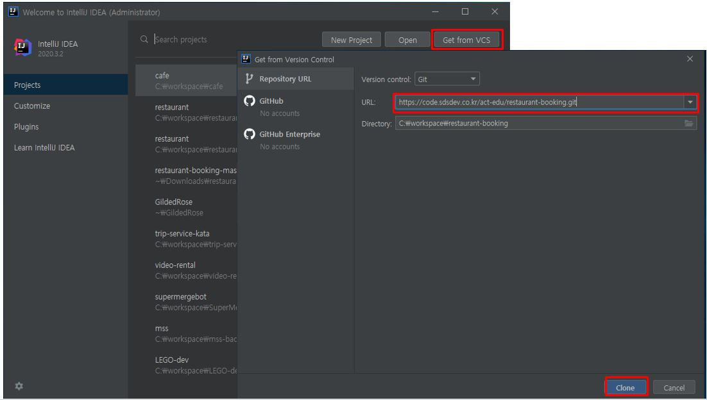
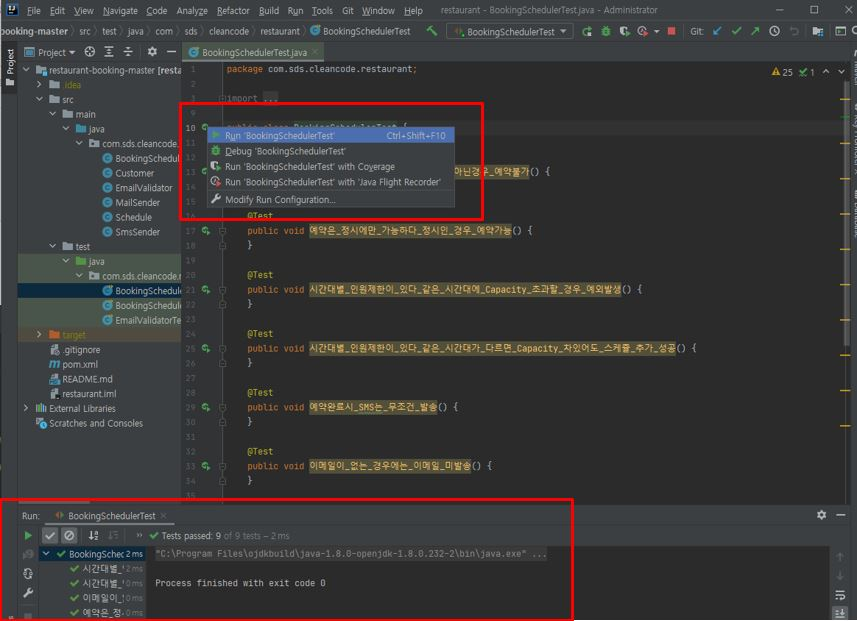

# 프로젝트 환경 설정

### 초기 프로젝트 git에서 clone하기

* https://code.sdsdev.co.kr/act-edu/restaurant-booking

### 테스트 케이스 실행

* Src/test/java/BookingSchedulerTest.java 파일 실행해서 테스트 케이스 실행 되는지 확인

[다음](02_junit.md)
