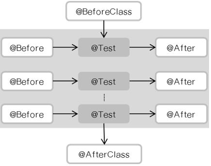
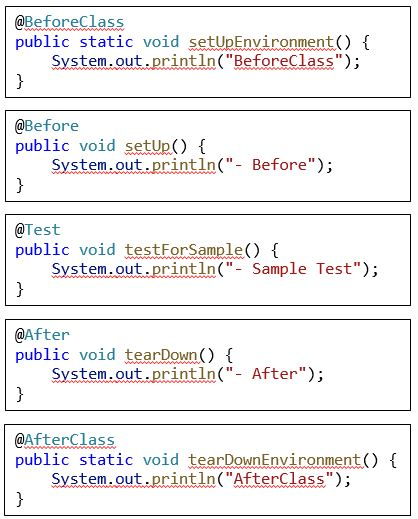

# JUint

## JUnit이 제공하는 기능

* 여러 테스트에서 공용으로 사용할 수 있도록 해주는 테스트 픽스처(Test Fixture)

    * @BeforeClass, @AfterClass, @Before, @After
    
* 테스트 메소드를 실행할 수 있게 해주는 테스트 러너(Test Runner)

    * @RunWith(SpringRunner.class)

* 테스트 결과가 예상과 같은지를 판별해주는 단정문(Assertions)

    * assertEquals(“message parameter”, “expected value”, “actual value”);

## JUnit Test Fixtures

* Test Fixture 란?

    * 테스트를 반복 수행하고 매번 동일한 결과를 얻을 수 있게 도와주는 “기반이 되는 상태나 환경”

* Test Fixture Method

    * setUp(), tearDown() 
    
    * Test Fixture를 만들고 정리하는 작업을 수행






## JUnit Runner

* @RunWith

    * 테스트 실행을 담당하는 클래스를 지정 (기본 Runner는 BlockJUnit4ClassRunner)
    
    * JUnit의 Runner 클래스를 확장하여 특정 기능을 추가해 테스트를 하게 한다→ 테스트 실행 절차와 전체 테스트 프로세스를 변경할 수 있다
    
    * 많은 어플리케이션이나 프레임워크에서 Runner를 제공→ SpringJUnit4ClassRunner(SpringRunner), MockitoJUnitRunner 등

```
 @RunWith(SpringRunner.class)
 @SpringBootTest
 public class CalculatorTest {
     ...
 }
```

## JUnit Assertions

* assert* 메서드를 통해 결과를 검증

* Hamcrest(Matcher Library)를 이용한 비교표현의 확장
    
    * JUnit4.4 부터 함께 배포됨
    
    * 일상언어에 가까운 테스트 케이스 구문 작성 가능

```
public class PersonTest {
    @Test
    public void testGetDisplayName() {
        // setup
        Person person = new Person("Gogh", "Vincent");
        // exercise
        String displayName = person.getDisplayName();

        // Junit assertEquals 사용
        assertEquals(“Vincent Gogh”, displayName);

        // Hamcrest 사용
        assertThat(displayName, is(equalTo("Vincent Gogh")));            
    }
}
```


## JUnit4 vs JUnit5

* JUnit 4
    
    * JDK 5 이상
    
    * 단일 모듈(jar)
    
    * @BeforeClass, @AfterClass, @Before, @After, @Ignore, @Category …
    
    * assertEquals(“message parameter”, “expected value”, “actual value”);

* JUnit 5 (‘17~)
    
    * JDK 8 이상 → lamda 사용 가능

    * 3개의 모듈로 구성 (JUnit Platform, JUnit Jupiter, JUnit Vintage)
    
    * @BeforeAll, @AfterAll, @BeforeEach, @AfterEach, @Disable, @Tag, @Nested, @ExtendWith ...
    
    * assertEquals(“expected value”, “actual value”, “message parameter”);
    
    * assertAll(), assertThrows()

* JUnit5에서 Junit4로 테스트 작성하기 위해서 vintage engine dependency를 추가한다.

```
testImplementation(“org.junit.vintage:junit-vintage-engine”){
	exclude group: “org.hamcrest”, module: “hamcrest-core”
}
```

## 테스트 코드 명세

* 영어 vs 한글?


```
public class BookingSchedulerTest {
   @Test   public void 예약은_정시에만_가능하다_정시가_아닌경우_예약불가() {
   }

   @Test   public void 예약은_정시에만_가능하다_정시인_경우_예약가능() {
   }

   @Test   public void 시간대별_인원제한이_있다_같은_시간대에_Capacity_초과할_경우_예외발생() {
   }

   @Test   public void 시간대별_인원제한이_있다_같은_시간대가_다르면_Capacity_차있어도_스케쥴_추가_성공() {
   }
}
```

* GivenWhenThen Template

```
    @Test   public void given_projectId_when_call_getCommentsByRelationId_then_call_findByRelationId() {
    }

    @Test   public void when_call_getCommentById_then_call_findById_of_repository() {
    }

    @Test   public void given_relationIds_when_call_getCommentsByRelationIds_then_call_findAllByRelationIdInAndDelYn() {
    }
```
[이전](01_setup.md) [다음](03_domain_overview.md)