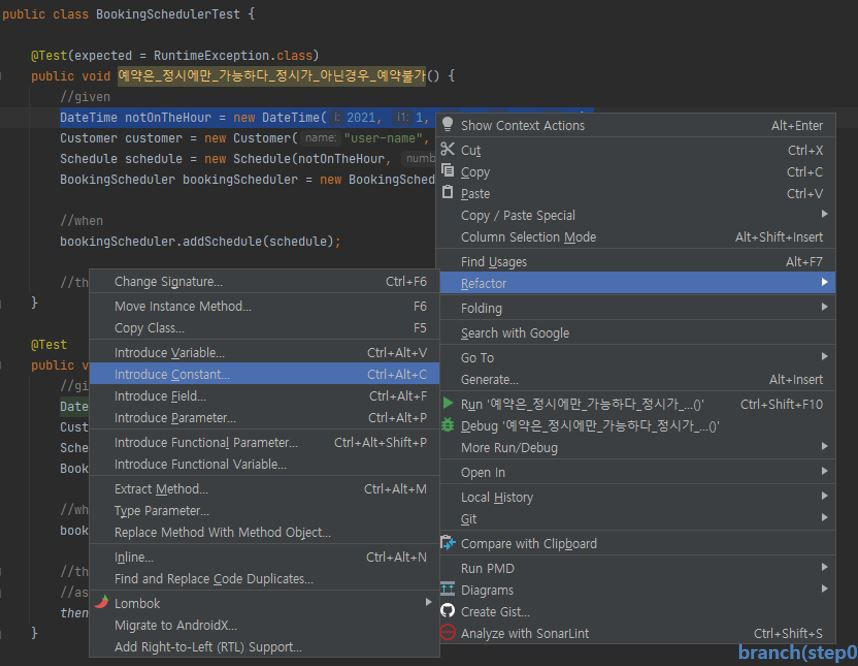
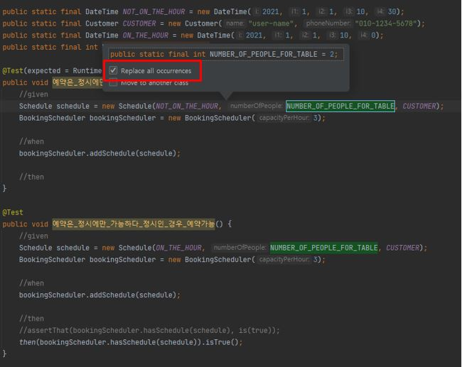

# 테스트 케이스 작성

## Mock을 사용하지 않고 테스트 케이스 작성

### Step1. "예약은 정시에만 가능하다." 테스트 작성

* 정시가 아닌 경우 예외 발생 테스트
* Junit expected 사용하여 테스트 결과 확인

```java
import org.joda.time.DateTime;
import org.junit.Test;

import static org.hamcrest.CoreMatchers.is;
import static org.junit.Assert.assertThat;

public class BookingSchedulerTest {

    @Test(expected = RuntimeException.class)
    public void 예약은_정시에만_가능하다_정시가_아닌경우_예약불가() {
        //given
        BookingScheduler bookingScheduler = new BookingScheduler(5);
        DateTime notOnTheHour = new DateTime(2021, 6, 14, 13, 30);
        Customer customer = new Customer("user-name", "010-1234-5678");
        Schedule schedule = new Schedule(notOnTheHour, 3, customer);
        //when
        bookingScheduler.addSchedule(schedule);

        //then
    }
}
```

※ Jodatime : https://www.joda.org/joda-time/
Java date와 time을 대체하기 위한 라이브러리 Apache 2.0 라이센스

### Step2. "예약은 정시에만 가능하다." 테스트 작성

* 정시인경우 스케줄 추가 성공 테스트

```java
public class BookingSchedulerTest {
    @Test
    public void 예약은_정시에만_가능하다_정시인_경우_예약가능() {
        //given
        BookingScheduler bookingScheduler = new BookingScheduler(5);
        DateTime onTheHour = new DateTime(2021, 6, 5, 12, 0);
        Customer customer = new Customer("user-name", "010-123-1234");
        Schedule schdule = new Schedule(onTheHour, 3, customer);

        //when
        bookingScheduler.addSchedule(schdule);

        //then
        assertThat(bookingScheduler.hasSchedule(schdule), is(true));
    }
}
```

### Step3. 테스트 케이스 리팩토링

* Extract Constant

    * Refactor > Introduce Constant...

    * 단축키 Refacotr This : Ctrl + Shift + Alt + T

    * NOT_ON_THE_HOUR, ON_THE_HOUR, CUSTOMER



```java
public class BookingSchedulerTest {

    public static final DateTime NOT_ON_THE_HOUR = new DateTime(2021, 6, 14, 13, 30);
    public static final DateTime ON_THE_HOUR = new DateTime(2021, 6, 14, 14, 0);
    public static final Customer CUSTOMER = new Customer("user-name", "010-1234-5678");

    @Test(expected = RuntimeException.class)
    public void 예약은_정시에만_가능하다_정시가_아닌경우_예약불가() {
        //given
        BookingScheduler bookingScheduler = new BookingScheduler(5);
        Schedule schedule = new Schedule(NOT_ON_THE_HOUR, 3, CUSTOMER);
        //when
        bookingScheduler.addSchedule(schedule);

        //then
    }

    @Test
    public void 예약은_정시에만_가능하다_정시인_경우_예약가능() {
        //given
        BookingScheduler bookingScheduler = new BookingScheduler(5);
        Schedule schdule = new Schedule(ON_THE_HOUR, 3, CUSTOMER);

        //when
        bookingScheduler.addSchedule(schdule);

        //then
        assertThat(bookingScheduler.hasSchedule(schdule), is(true));
    }
}
```

* Extract Constant(Magic Number)

    * Refactor > Introduce Constant...

    * 단축키 Refacotr This : Ctrl + Shift + Alt + T

    * NUMBER_OF_PEOPLE_FOR_TABLE

    * CAPACITY_PER_HOUR



```java
public class BookingSchedulerTest {

    public static final DateTime NOT_ON_THE_HOUR = new DateTime(2021, 6, 14, 13, 30);
    public static final DateTime ON_THE_HOUR = new DateTime(2021, 6, 14, 14, 0);
    public static final Customer CUSTOMER = new Customer("user-name", "010-1234-5678");
    public static final int NUMBER_OF_PEOPLE_FOR_TABLE = 3;
    public static final int CAPACITY_PER_HOUR = 5;

    @Test(expected = RuntimeException.class)
    public void 예약은_정시에만_가능하다_정시가_아닌경우_예약불가() {
        //given
        BookingScheduler bookingScheduler = new BookingScheduler(CAPACITY_PER_HOUR);
        Schedule schedule = new Schedule(NOT_ON_THE_HOUR, NUMBER_OF_PEOPLE_FOR_TABLE, CUSTOMER);
        //when
        bookingScheduler.addSchedule(schedule);

        //then
    }

    @Test
    public void 예약은_정시에만_가능하다_정시인_경우_예약가능() {
        //given
        BookingScheduler bookingScheduler = new BookingScheduler(CAPACITY_PER_HOUR);
        Schedule schdule = new Schedule(ON_THE_HOUR, NUMBER_OF_PEOPLE_FOR_TABLE, CUSTOMER);

        //when
        bookingScheduler.addSchedule(schdule);

        //then
        assertThat(bookingScheduler.hasSchedule(schdule), is(true));
    }
}
```

* Extract Method

    * BookingScheduler Initialization 중복 제거

    * JUnit의 Implicit Setup 적용

```java
public class BookingSchedulerTest {

    public static final DateTime NOT_ON_THE_HOUR = new DateTime(2021, 6, 14, 13, 30);
    public static final DateTime ON_THE_HOUR = new DateTime(2021, 6, 14, 14, 0);
    public static final Customer CUSTOMER = new Customer("user-name", "010-1234-5678");
    public static final int NUMBER_OF_PEOPLE_FOR_TABLE = 3;
    public static final int CAPACITY_PER_HOUR = 5;
    private BookingScheduler bookingScheduler;

    @Before
    public void setUp() throws Exception {
        bookingScheduler = new BookingScheduler(CAPACITY_PER_HOUR);
    }

    @Test(expected = RuntimeException.class)
    public void 예약은_정시에만_가능하다_정시가_아닌경우_예약불가() {
        //given
        Schedule schedule = new Schedule(NOT_ON_THE_HOUR, NUMBER_OF_PEOPLE_FOR_TABLE, CUSTOMER);
        //when
        bookingScheduler.addSchedule(schedule);

        //then
    }

    @Test
    public void 예약은_정시에만_가능하다_정시인_경우_예약가능() {
        //given
        Schedule schdule = new Schedule(ON_THE_HOUR, NUMBER_OF_PEOPLE_FOR_TABLE, CUSTOMER);

        //when
        bookingScheduler.addSchedule(schdule);

        //then
        assertThat(bookingScheduler.hasSchedule(schdule), is(true));
    }
}
```

### Step4. "시간대별 인원제한이 있다." 테스트 작성

* 같은 시간대에 Capacity를 초과했을 경우 예외 발생 테스트

```java
public class BookingSchedulerTest {
    @Test
    public void 시간대별_인원제한이_있다_같은_시간대에_Capacity_초과할_경우_예외발생() {
        //given
        Schedule schedule = new Schedule(ON_THE_HOUR, NUMBER_OF_PEOPLE_FOR_TABLE, CUSTOMER);
        bookingScheduler.addSchedule(schedule);

        //when
        try {
            bookingScheduler.addSchedule(schedule);
        } catch (RuntimeException e) {
            //then
            assertThat(e.getMessage(), is("Number of people is over restaurant capacity per hour"));
        }
    }
}
```

### Step5. "시간대별 인원제한이 있다." 테스트 작성

* 시간대가 다르면 Capacity가 차있어도 스케줄 추가 성공 테스트

```java
public class BookingSchedulerTest {
    @Test
    public void 시간대별_인원제한이_있다_시간대가_다르면_Capacity_차있어도_스케쥴_추가_성공() {
        //given
        Schedule schedule = new Schedule(ON_THE_HOUR, NUMBER_OF_PEOPLE_FOR_TABLE, CUSTOMER);
        bookingScheduler.addSchedule(schedule);

        //when
        DateTime diffrentHour = ON_THE_HOUR.plusHours(1);
        Schedule newSchdule = new Schedule(diffrentHour, NUMBER_OF_PEOPLE_FOR_TABLE, CUSTOMER);
        bookingScheduler.addSchedule(newSchdule);

        //then
        assertThat(bookingScheduler.hasSchedule(schedule), is(true));
    }
}
```

[이전](04_wirte_simple_unit_tests.md) [다음](06_test_double.md)