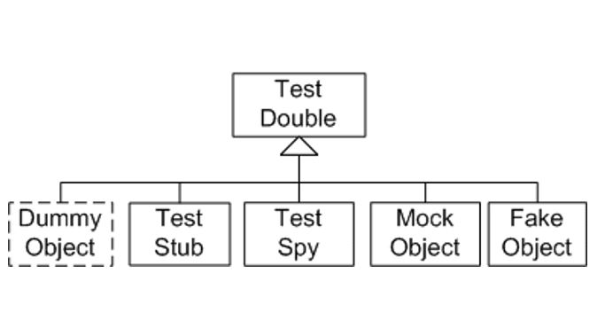

# Test Double

## Test Double 이란?

* xUnit Test Patterns by Gerard Meszaros
* 실제 객체를 사용하여 테스트하기 어려울 때 이를 대신해서 테스트를 수행하도록 만들어주는 객체




* 의존성을 가지는 ICoupon 인터페이스는 테스트 대상이 아닌 테스트를 위한 일종의 텍스트 픽스처

* 하지만, 구현 객체가 없으면 테스트 케이스를 작성할 수 없다

```java
public interface ICoupon {
    String getName(); // 쿠폰 이름

    boolean isValid(); // 쿠폰 유효 여부 확인}
}
```

```java
public class OrderTest {
    @Test
    public void testAddCoupon() {
        Order order = new Order();
        assertFalse(order.hasCoupon());
        ICoupon coupon = ???????  // 여기를 어떻게 처리하지? 구현 클래스를 만들까? 테스트 대상은 Order 클래스인데.. 
        order.addCoupon(coupon);
        assertTrue(order.hasCoupon());
    }
}
```

## Test Dummy

* 단순한 껍데기로 오로지 인스턴스화될 수 있는 수준으로만 구현한 객체
    * 인스턴스화된 객체가 필요할 뿐 해당 객체의 기능까지는 필요하지 않는 경우에 사용
    * 메소드가 호출됐을 때의 정상 동작은 보장되지 않음

```java
public class OrderTest {
    @Test
    public void testAddCouponWithDummy() {
        Order order = new Order();
        assertFalse(order.hasCoupon());
        ICoupon coupon = new DummyCoupon();
        order.addCoupon(coupon);
        assertTrue(order.hasCoupon());
    }
}
```

```java
public class DummyCoupon implements ICoupon {
    public String getName() {
        return null;
    }

    public boolean isValid() {
        throw new UnsupportedOperationException("호출되지 않을 예정임");
    }
}
```

## Test Stub

* 객체의 특정 상태를 가정해서 만들어 놓은 단순 구현체

    * 더미 객체가 마치 실제로 동작하는 것처럼 보이게 만들어놓은 객체

    * 호출에 대해 미리 준비된 값을 리턴해 주거나 특정 메시지를 출력하는 등의 작업을 수행

```java
public class OrderTest {
    @Test
    public void testAddCouponWithStub() {
        Order order = new Order();
        ICoupon eventCoupon = new StubCoupon();
        order.addCoupon(eventCoupon);
        assertEquals("5월 감사쿠폰", order.getCoupon().getName());
    }
}
```

```java
public class StubCoupon implements ICoupon {
    public String getName() {
        return "5월 감사쿠폰";
    }

    public boolean isValid() {
        return true;
    }
}
```

## Test Spy

* 호출 시점의 객체 상태를 감시하여 기록해놓고 요청이 들어오면 해당 정보를 전달

    * 특정 메소드의 정상호출 여부 확인을 목적으로 구현

    * Spy는 실제 클래스의 복사본이므로 실제 메소드가 호출됨

    * ex) 전송된 메시지의 수를 기록하는 이메일 서비스를 테스트하는 경우

```java
public class OrderTest {
    @Test
    public void testAddCouponWithStub() {
        Order order = new Order();
        ICoupon spyCoupon = new SpyCoupon();
        order.addCoupon(spyCoupon);

        order.calc();
        assertEquals(1, ((SpyCoupon) spyCoupon).getIsValidMethodCallCount());
    }
}
```

```java
public class SpyCoupon extends Coupon {
    private int isValidMethodCallCount;

    @Override
    public boolean isValid() {
        isValidMethodCallCount++;
        return super();
    }

    public int getIsValidMethodCallCount() {
        return isValidMethodCallCount;
    }
}
```

## Mock Object

* 행위(behavior)를 검증하기 위해 사용되는 객체

    * 행위기반테스트는 테스트를 수행할 때 예상되는 행위들을 미리 시나리오로 만들어 놓고 해당 시나리오대로 동작했는지 여부를 확인

    * 대부분 Mock 프레임워크를 사용

```java
public class OrderTest {
    @Test
    public void testAddCouponWithStub() {
        Order order = new Order();
        ICoupon mockCoupon = new MockCoupon();
        order.addCoupon(mockCoupon);

        order.calc();
        assertEquals(1, ((MockCoupon) mockCoupon).getIsValidMethodCallCount());
    }
}
```

```java
public class MockCoupon implements ICoupon {
    private int isValidMethodCallCount;

    public String getName() {
        return null;
    }

    public boolean isValid() {
        isValidMethodCallCount++;
        return false;
    }

    public int getIsValidMethodCallCount() {
        return isValidMethodCallCount;
    }
}
```

* Mock 프레임워크를 사용

```java
public class OrderTest {
    @Test
    public void testAddCouponWithMockFramework() {
        ICoupon mockCoupon = mock(ICoupon.class);
        when(mockCoupon.isValid()).thenReturn(true);
        Order order = new Order();
        order.addCoupon(mockCoupon);
        order.calc();
        verify(mockCoupon, times(1)).isValid();
    }
}
```

[이전](05_write_tests.md)  [다음](07_write_tests_without_mocks.md)